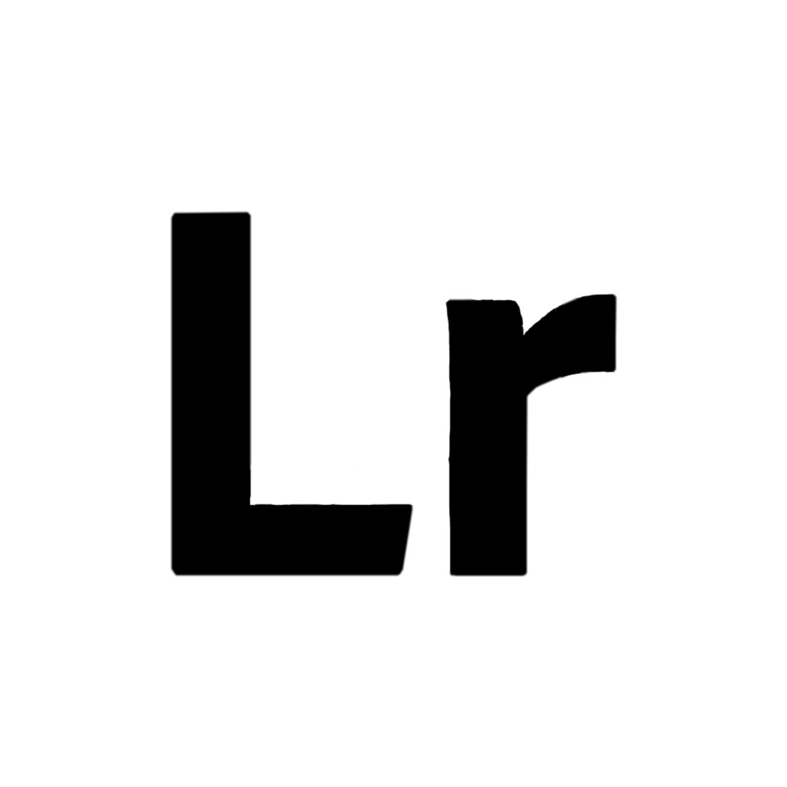

<h1>Dein SEO Experte</h1>

<h1>Wir sind ranklike - SEO Experten aus Hamburg - Deine SEO-Agentur</h1>

  

<h2>#1 SEO Beratung in Hamburg</h2>

<a href="https://ranklike.de/">ranklike - SEO Experte Hamburg</a> ist die Lösung für KMU und Start-ups, die mehr Sichtbarkeit in den Suchergebnissen erreichen möchten. Wir sind spezialisiert auf lokale Suchmaschinenoptimierung (<a href="https://ranklike.de/local-seo/ ">Local SEO</a>) sowie OnPage-SEO, um Dir eine effektive Möglichkeiten zu bieten, das Ranking Deiner Website bei Google und anderen Suchmaschinen zu verbessern. ranklike SEO Hamburg macht es einfach, Dein lokales Publikum anzusprechen, sodass Du dich auf das konzentrieren kannst, was Du am besten kannst – Dein Unternehmen führen.

 

<!--  -->

<!--  -->

 

       
- 🚀 Über 12+ Jahre Erfahrung im digitalen Marketing Umfeld 
- ⚡️ Spezialisiert auf Suchmaschinenoptimierung 
- 🎯 Maßgeschneiderte SEO-Lösungen 
- 🔎 Online-Shop SEO und Website Optimierungen
- 📌 Professionelle und zuverlässige SEO-Beratung   

       
  

   

    
    
    

<h4>SEO Hamburg</h4>

Deine <a href="https://ranklike.de/">SEO Hamburg Agentur </a>die für Deine Website mehr Traffic generiert.  

<h3>Tools die wir nutzen</h3>

<h4 style="display: inline;">Suchmaschinenoptimierung</h4>

<a href="https://ranklike.de/local-seo/ ">Effektive Suchmaschinenoptimierung</a> verbessert nachhaltig die Position
Deiner Website im Internet. Entdecke alle unsere SEO-Leistungen.  

<h4>SEO-Experte</h4>

Mit unserer SEO-Beratung erhältst Du einen <a href="https://ranklike.de/seo-experte/">SEO-Experten</a> für eine
individuelle SEO-Lösung.  

<h4>Local SEO</h4>
<a href="https://ranklike.de/local-seo/">Lokale Suchmaschinenoptimierung die Local-SEO</a>, für eine höhere
Platzierung in den lokalen Suchanfragen.  

<h4>E-Commerce SEO</h4>
Eine effektive <a href="https://ranklike.de/e-commerce-seo/">E-Commerce SEO</a> Lösung für Produkte und Onlineshops.
Besser ranken!  

<h4>OffPage-SEO</h4>
Mit der passenden <a href="https://ranklike.de/offpage-seo/">OffPage Strategie</a>, erhöhen wir die Autorität und
das Vertrauen Deiner Website.  

<h4>OnPage Optimierung</h4>
<a href="https://ranklike.de/onpage-seo/">OnPage-Optimierungen</a> Deiner Website-Inhalte, um maßgeblich die
Sichtbarkeit zu steigern.  

<h4>Technisches-SEO</h4>
Durch die <a href="https://ranklike.de/technisches-seo/">Technische SEO</a> ergreifen wir alle technischen Maßnahmen
zur Verbesserung Deiner Rankings.  

<h4>Bilder SEO</h4>
Als erfahrener Experte für <a href="https://ranklike.de/bilder-seo/">Bilder-SEO</a> profitieren Du von einer
maximalen Optimierung für Bilder und Grafiken.  

<h4>Site-Audit</h4>
Mit einer umfangreichen <a href="https://ranklike.de/site-audit/">Site-Audit Seitenanalyse </a>finden Sie schnell
Optimierungsmöglichkeiten.  

<h4>Keyword Analyse</h4>
Die <a href="https://ranklike.de/keyword-analyse/">Keyword Analyse</a> dient Dir als Grundlage
sämtlicher Suchmaschinenoptimierung  

<h4>Backlinkaufbau</h4>
Klasse statt Masse! Mit einem autoritären <a href="https://ranklike.de/backlinkaufbau/">Backlinkaufbau </a>steigern
wir Deine Sichtbarkeit.

 
 

<h3>Tools die wir nutzen</h3>

        
        
        
        
        
        
        
        

 
 

<h3>Was wir können</h3>
<table>
        <tr>
            <td align="center" width="96" style="border:1px solid #3A424A">
                
                 HTML
            </td>
            <td align="center" width="96" style="border:1px solid #3A424A">
                
                 CSS
            </td>
            <td align="center" width="96" style="border:1px solid #3A424A">
                
                 Javascript
            </td>
            <td align="center" width="96" style="border:1px solid #3A424A">
                
                 Bootstrap
            </td>
            <td align="center" width="96" style="border:1px solid #3A424A">
                
                 ebay
            </td>
            <td align="center" width="96" style="border:1px solid #3A424A">
                
                 amazon
            </td>
            <td align="center" width="96" style="border:1px solid #3A424A">
                
                 shopify
            </td>
            <td align="center" width="96" style="border:1px solid #3A424A">
                
                 Wordpress
            </td>
            <td align="center" width="96" style="border:1px solid #3A424A">
                
                 woocommerce
            </td>
            <td align="center" width="96" style="border:1px solid #3A424A">
                
                 Prestashop
            </td>
            <td align="center" width="96" style="border:1px solid #3A424A">
                
                 xt-commerce
            </td>
            </td>
            <td align="center" width="96" style="border:1px solid #3A424A">
                
                 wix
            </td>
            </td>
            <td align="center" width="96" style="border:1px solid #3A424A">
                
                 shopware
            </td>
            </td>
            <td align="center" width="96" style="border:1px solid #3A424A">
                
                 G-cloud
            </td>
            <td align="center" width="96" style="border:1px solid #3A424A">
                
                 aws
            </td>
            <td align="center" width="96" style="border:1px solid #3A424A">
                
                 azure
            </td>
        </tr>
</table>

 
 

<h3>Verbinde dich mit uns</h3>

    
    
    
    
    
    
    
           
    

<!-- THOSE SVG IS NOT VISIBLE DUE TO SOME REASON -->
       
  <!-- <svg width="48" height="48" viewBox="0 0 48 48" fill="none" xmlns="http://www.w3.org/2000/svg">
<path fill-rule="evenodd" clip-rule="evenodd"
d="M0 24C0 10.7452 10.7452 0 24 0C37.2548 0 48 10.7452 48 24C48 37.2548 37.2548 48 24 48C10.7452 48 0 37.2548 0 24ZM23.2812 19.5075L23.3316 20.338L22.4922 20.2363C19.4369 19.8465 16.7677 18.5245 14.5013 16.3043L13.3934 15.2027L13.108 16.0162C12.5036 17.8296 12.8897 19.7448 14.1488 21.0328C14.8203 21.7446 14.6692 21.8463 13.5109 21.4226C13.108 21.287 12.7554 21.1854 12.7219 21.2362C12.6044 21.3548 13.0073 22.8971 13.3262 23.5072C13.7627 24.3546 14.6524 25.1851 15.6261 25.6766L16.4487 26.0664L15.475 26.0833C14.5349 26.0833 14.5013 26.1003 14.6021 26.4562C14.9378 27.5578 16.264 28.7272 17.7413 29.2357L18.7822 29.5916L17.8756 30.1339C16.5326 30.9135 14.9546 31.3542 13.3766 31.3881C12.6211 31.405 12 31.4728 12 31.5237C12 31.6931 14.0481 32.6422 15.24 33.0151C18.8157 34.1167 23.063 33.6422 26.2526 31.7609C28.5189 30.422 30.7852 27.7612 31.8428 25.1851C32.4136 23.8123 32.9844 21.304 32.9844 20.1007C32.9844 19.3211 33.0347 19.2194 33.9748 18.2872C34.5288 17.7449 35.0492 17.1517 35.15 16.9822C35.3178 16.6602 35.3011 16.6602 34.4449 16.9483C33.018 17.4568 32.8165 17.389 33.5216 16.6263C34.042 16.084 34.6631 15.101 34.6631 14.8129C34.6631 14.762 34.4113 14.8468 34.1259 14.9993C33.8238 15.1688 33.1523 15.423 32.6486 15.5756L31.7421 15.8637L30.9195 15.3044C30.4663 14.9993 29.8283 14.6604 29.4926 14.5587C28.6364 14.3214 27.327 14.3553 26.5548 14.6265C24.4563 15.3891 23.1301 17.3551 23.2812 19.5075Z"
fill="#00fdb0" />
</svg>

<svg width="48" height="48" viewBox="0 0 48 48" fill="none" xmlns="http://www.w3.org/2000/svg">
<path fill-rule="evenodd" clip-rule="evenodd"
d="M0 24C0 10.7452 10.7452 0 24 0C37.2548 0 48 10.7452 48 24C48 37.2548 37.2548 48 24 48C10.7452 48 0 37.2548 0 24ZM38.2954 23.7986C38.2954 20.3766 35.4692 17.6 31.9766 17.6C28.4805 17.6 25.6527 20.3766 25.6527 23.7986C25.6527 27.2222 28.4805 29.9989 31.9766 29.9989C35.4692 29.9989 38.2954 27.2222 38.2954 23.7986ZM22.241 23.7986C22.241 20.3766 19.4132 17.6 15.9171 17.6C12.4262 17.6 9.6 20.3766 9.6 23.7986C9.6 27.2222 12.4262 29.9989 15.9171 29.9989C19.4132 29.9989 22.241 27.2222 22.241 23.7986Z"
fill="#00fdb0" />
</svg>
<svg width="48" height="48" viewBox="0 0 48 48" fill="none" xmlns="http://www.w3.org/2000/svg">
<path fill-rule="evenodd" clip-rule="evenodd"
d="M0 24C0 10.7452 10.7452 0 24 0C37.2548 0 48 10.7452 48 24C48 37.2548 37.2548 48 24 48C10.7452 48 0 37.2548 0 24ZM26.5016 38.1115V25.0542H30.1059L30.5836 20.5546H26.5016L26.5077 18.3025C26.5077 17.1289 26.6192 16.5001 28.3048 16.5001H30.5581V12H26.9532C22.6231 12 21.0991 14.1828 21.0991 17.8536V20.5551H18.4V25.0547H21.0991V38.1115H26.5016Z"
fill="#00fdb0" />
</svg>
<svg width="48" height="48" viewBox="0 0 48 48" fill="none" xmlns="http://www.w3.org/2000/svg">
<path fill-rule="evenodd" clip-rule="evenodd"
d="M0 24C0 10.7452 10.7452 0 24 0C37.2548 0 48 10.7452 48 24C48 37.2548 37.2548 48 24 48C10.7452 48 0 37.2548 0 24ZM24.0012 11.2C20.5249 11.2 20.0886 11.2152 18.7233 11.2773C17.3606 11.3397 16.4305 11.5555 15.6166 11.872C14.7747 12.1989 14.0606 12.6363 13.3491 13.348C12.6371 14.0595 12.1997 14.7736 11.8717 15.6152C11.5544 16.4294 11.3384 17.3598 11.2771 18.7219C11.216 20.0873 11.2 20.5238 11.2 24.0001C11.2 27.4764 11.2155 27.9114 11.2773 29.2767C11.34 30.6394 11.5557 31.5695 11.872 32.3834C12.1992 33.2253 12.6365 33.9394 13.3483 34.6509C14.0595 35.3629 14.7736 35.8013 15.615 36.1283C16.4294 36.4448 17.3598 36.6605 18.7222 36.7229C20.0876 36.7851 20.5236 36.8003 23.9996 36.8003C27.4762 36.8003 27.9111 36.7851 29.2765 36.7229C30.6391 36.6605 31.5703 36.4448 32.3848 36.1283C33.2264 35.8013 33.9394 35.3629 34.6506 34.6509C35.3626 33.9394 35.8 33.2253 36.128 32.3837C36.4427 31.5695 36.6587 30.6391 36.7227 29.277C36.784 27.9116 36.8 27.4764 36.8 24.0001C36.8 20.5238 36.784 20.0876 36.7227 18.7222C36.6587 17.3595 36.4427 16.4294 36.128 15.6155C35.8 14.7736 35.3626 14.0595 34.6506 13.348C33.9386 12.636 33.2266 12.1987 32.384 11.872C31.5679 11.5555 30.6373 11.3397 29.2746 11.2773C27.9092 11.2152 27.4746 11.2 23.9972 11.2H24.0012Z"
                        fill="#00fdb0" />
<path fill-rule="evenodd" clip-rule="evenodd"
d="M22.8529 13.5067C23.1937 13.5062 23.574 13.5067 24.0012 13.5067C27.4188 13.5067 27.8239 13.519 29.1735 13.5803C30.4215 13.6374 31.0989 13.8459 31.5501 14.0211C32.1474 14.2531 32.5733 14.5304 33.021 14.9784C33.469 15.4264 33.7464 15.8531 33.9789 16.4505C34.1541 16.9011 34.3629 17.5785 34.4197 18.8265C34.481 20.1758 34.4944 20.5812 34.4944 23.9972C34.4944 27.4132 34.481 27.8186 34.4197 29.1679C34.3626 30.4159 34.1541 31.0933 33.9789 31.5439C33.7469 32.1413 33.469 32.5666 33.021 33.0144C32.573 33.4624 32.1477 33.7397 31.5501 33.9717C31.0994 34.1477 30.4215 34.3557 29.1735 34.4128C27.8242 34.4741 27.4188 34.4874 24.0012 34.4874C20.5833 34.4874 20.1782 34.4741 18.8289 34.4128C17.5809 34.3552 16.9035 34.1466 16.4521 33.9714C15.8547 33.7394 15.428 33.4621 14.98 33.0141C14.532 32.5661 14.2547 32.1405 14.0222 31.5429C13.847 31.0922 13.6382 30.4149 13.5814 29.1669C13.52 27.8175 13.5078 27.4122 13.5078 23.994C13.5078 20.5758 13.52 20.1726 13.5814 18.8233C13.6384 17.5753 13.847 16.8979 14.0222 16.4467C14.2542 15.8494 14.532 15.4227 14.98 14.9747C15.428 14.5267 15.8547 14.2494 16.4521 14.0168C16.9033 13.8408 17.5809 13.6328 18.8289 13.5755C20.0097 13.5222 20.4673 13.5062 22.8529 13.5035V13.5067ZM30.8338 15.632C29.9858 15.632 29.2978 16.3193 29.2978 17.1675C29.2978 18.0155 29.9858 18.7035 30.8338 18.7035C31.6818 18.7035 32.3698 18.0155 32.3698 17.1675C32.3698 16.3195 31.6818 15.632 30.8338 15.632ZM24.0012 17.4267C20.371 17.4267 17.4278 20.37 17.4278 24.0001C17.4278 27.6303 20.371 30.5722 24.0012 30.5722C27.6314 30.5722 30.5735 27.6303 30.5735 24.0001C30.5735 20.37 27.6314 17.4267 24.0012 17.4267Z"
                        fill="#00fdb0" />
<path fill-rule="evenodd" clip-rule="evenodd"
d="M24.0012 19.7334C26.3575 19.7334 28.2679 21.6436 28.2679 24.0001C28.2679 26.3564 26.3575 28.2668 24.0012 28.2668C21.6446 28.2668 19.7345 26.3564 19.7345 24.0001C19.7345 21.6436 21.6446 19.7334 24.0012 19.7334Z"
fill="#00fdb0" />
</svg>
<svg width="48" height="48" viewBox="0 0 48 48" fill="none" xmlns="http://www.w3.org/2000/svg">
<path fill-rule="evenodd" clip-rule="evenodd"
d="M23.9605 47.4831C10.7255 47.4831 0.000488281 36.9206 0.000488281 23.8949C0.000488281 10.8692 10.7255 0.309204 23.9605 0.309204C37.193 0.309204 47.9206 10.8692 47.9206 23.8949C47.9206 36.9206 37.193 47.4831 23.9605 47.4831ZM2.21736 23.8951C2.21736 32.9495 7.94047 40.685 16.017 43.8C15.8271 42.1099 15.6577 39.5154 16.094 37.6661C16.4866 35.9987 18.6399 27.0429 18.6399 27.0429C18.6399 27.0429 17.9906 25.7621 17.9906 23.8699C17.9906 20.8964 19.7383 18.6783 21.9197 18.6783C23.7701 18.6783 24.6658 20.0476 24.6658 21.6897C24.6658 23.5238 23.4801 26.2648 22.8667 28.8063C22.356 30.936 23.9523 32.669 26.0825 32.669C29.9424 32.669 32.9091 28.6623 32.9091 22.8796C32.9091 17.7612 29.175 14.184 23.8394 14.184C17.662 14.184 14.0357 18.7465 14.0357 23.4606C14.0357 25.2972 14.7517 27.2678 15.65 28.3389C15.8271 28.5511 15.8527 28.7356 15.8014 28.9528C15.6371 29.6274 15.2702 31.08 15.1983 31.3756C15.1033 31.7671 14.8826 31.8505 14.4694 31.6636C11.7593 30.4206 10.0655 26.5149 10.0655 23.3823C10.0655 16.6396 15.0417 10.445 24.4117 10.445C31.9442 10.445 37.7981 15.7301 37.7981 22.7911C37.7981 30.1579 33.0785 36.0871 26.5316 36.0871C24.3296 36.0871 22.2611 34.9604 21.5527 33.6316C21.5527 33.6316 20.4646 37.7116 20.2002 38.712C19.71 40.5688 18.3858 42.8956 17.5029 44.3153C19.533 44.9368 21.6913 45.2703 23.9318 45.2703C35.9247 45.2703 45.6463 35.7006 45.6463 23.8951C45.6463 12.0871 35.9247 2.51998 23.9318 2.51998C11.9389 2.51998 2.21736 12.0871 2.21736 23.8951Z"
fill="#00fdb0" />
</svg>
<svg width="48" height="48" viewBox="0 0 48 48" fill="none" xmlns="http://www.w3.org/2000/svg">
<path fill-rule="evenodd" clip-rule="evenodd"
d="M23.9999 0.03125C10.7967 0.03125 0.0449219 10.7346 0.0449219 23.9379C0.0449219 37.1411 10.7967 47.8445 23.9999 47.8445C37.2032 47.8445 47.9549 37.1411 47.9549 23.9379C47.9549 10.7346 37.2032 0.03125 23.9999 0.03125ZM29.0997 32.4369C29.8936 32.4171 30.9582 32.187 31.5149 31.9225L32.9547 36.1745C32.4151 36.9666 29.9712 37.884 27.7707 37.9216C21.2489 38.0334 18.7784 33.2938 18.7784 29.9575V20.2142H15.7484V16.3623C20.2904 14.7306 21.3824 10.6501 21.6389 8.32516C21.6567 8.16548 21.7827 8.10253 21.8549 8.10253H26.2392V15.699H32.2306V20.2144H26.2184V29.4978C26.2377 30.7598 26.7029 32.5007 29.0997 32.4369Z"
fill="#00fdb0" />
</svg>
<svg width="48" height="48" viewBox="0 0 48 48" fill="none" xmlns="http://www.w3.org/2000/svg">
<path fill-rule="evenodd" clip-rule="evenodd"
d="M0 24C0 10.7452 10.7452 0 24 0C37.2548 0 48 10.7452 48 24C48 37.2548 37.2548 48 24 48C10.7452 48 0 37.2548 0 24ZM16.9605 19.8778H11.5216V36.2196H16.9605V19.8778ZM17.3188 14.8227C17.2835 13.2204 16.1377 12 14.277 12C12.4164 12 11.2 13.2204 11.2 14.8227C11.2 16.3918 12.3805 17.6473 14.2064 17.6473H14.2412C16.1377 17.6473 17.3188 16.3918 17.3188 14.8227ZM36.5754 26.8497C36.5754 21.8303 33.8922 19.4941 30.3131 19.4941C27.4254 19.4941 26.1326 21.0802 25.4107 22.1929V19.8783H19.9711C20.0428 21.4117 19.9711 36.22 19.9711 36.22H25.4107V27.0934C25.4107 26.605 25.446 26.1178 25.5898 25.7681C25.9829 24.7924 26.8779 23.7822 28.3805 23.7822C30.3494 23.7822 31.1365 25.2807 31.1365 27.4767V36.2196H36.5752L36.5754 26.8497Z"
fill="#00fdb0" />
</svg> -->
 

 
 

            
<h4>Deine Experten für SEO Hamburg</h4>

  

Hier findet Ihr unser <a href="https://goo.gl/maps/gxpX35xVxXkvHy9j8">Hamburg SEO Experten Profil</a> in den Maps.

Wir nehmen gerne Eure Anfragen entgegen unter: <a href="https://ranklike.de/kontakt/">SEO-Anfrage starten</a>

